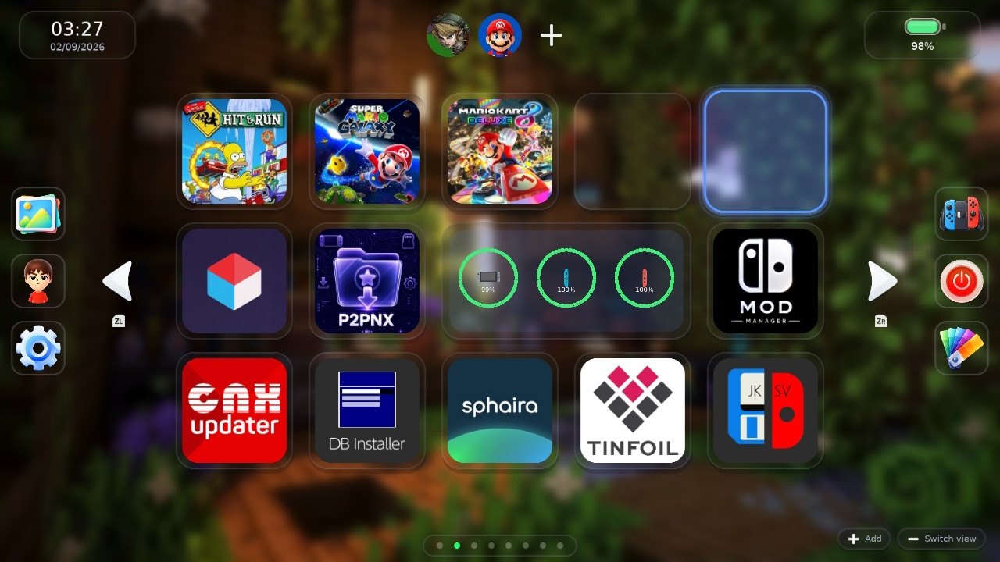
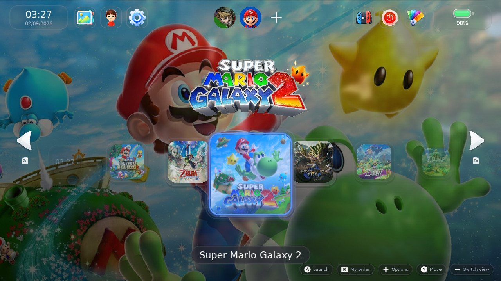
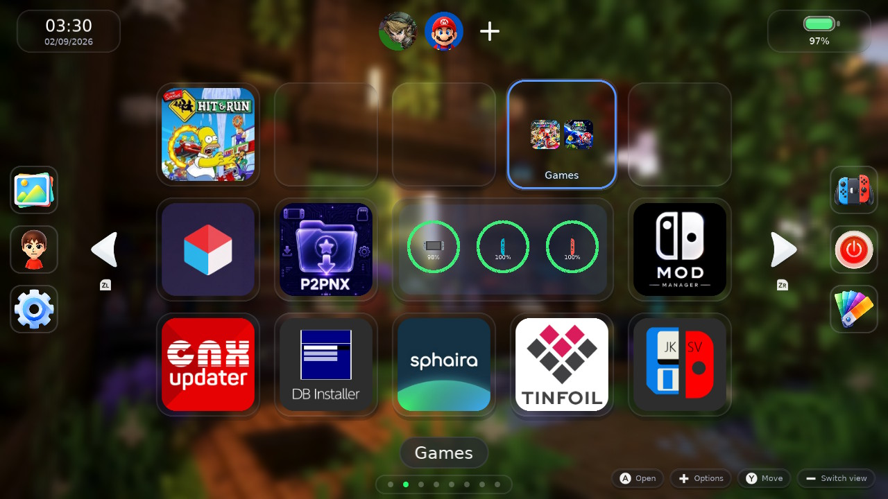
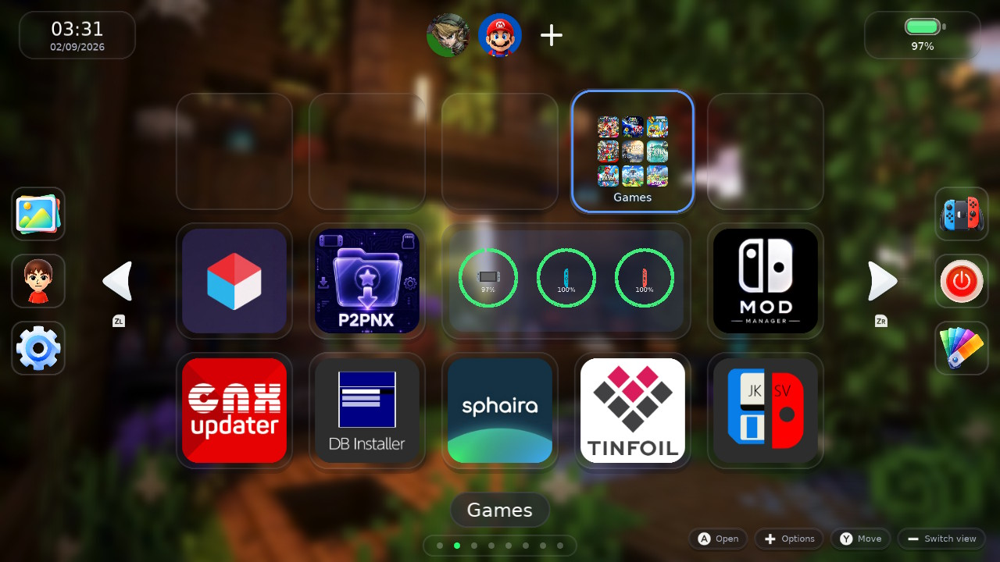
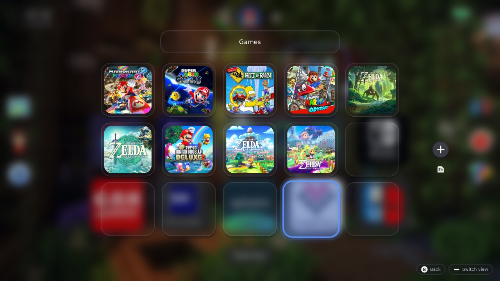
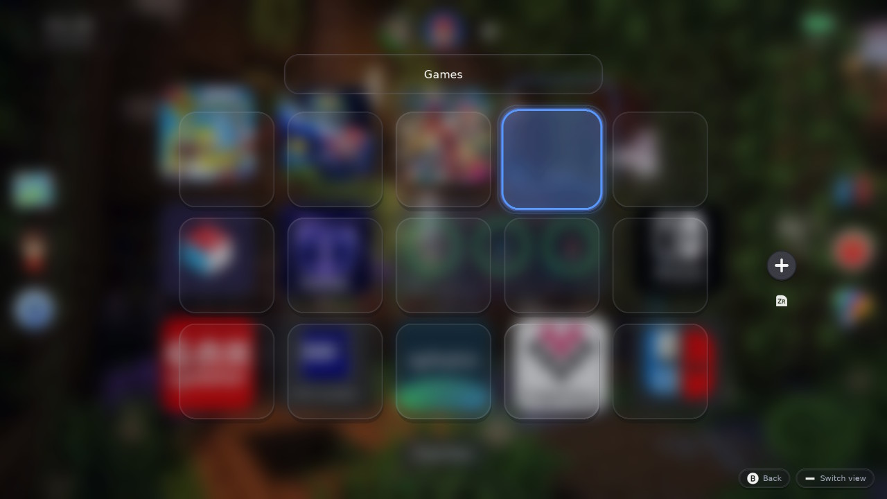
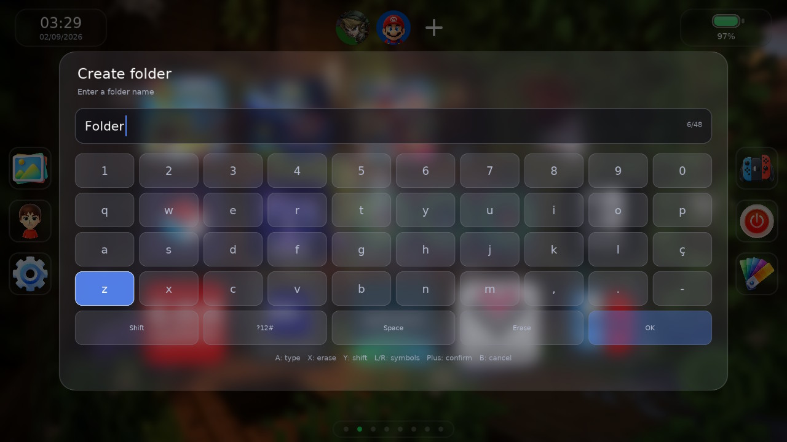
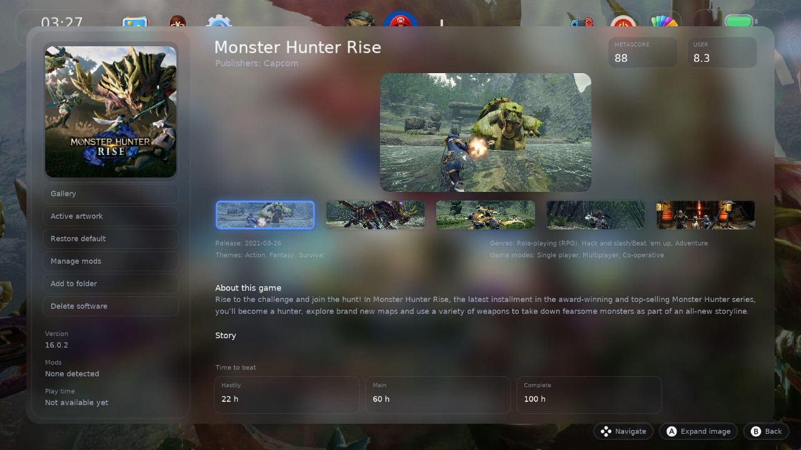
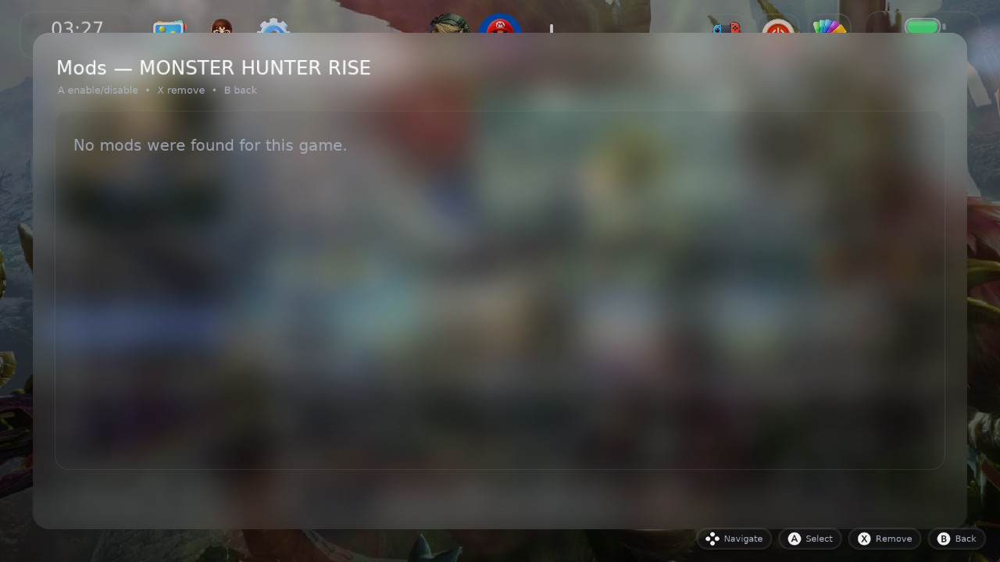
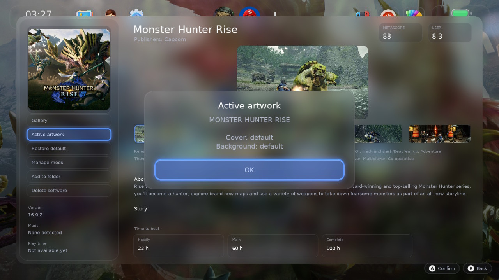

# SwitchU 1.1.0+fork.9

## English

Ninth release of the [ncarvalho99/SwitchU](https://github.com/ncarvalho99/SwitchU)
fork, based on [PoloNX/SwitchU](https://github.com/PoloNX/SwitchU) 1.1.0.

Changing theme could end the launcher. It no longer can, and the theme shop now
says what a theme costs before you take it.

### Changing theme could kill the launcher

- Switching between the default dark and light themes could fill the screen with
  colour noise and drop the console back to a relaunch. Reported by a player who
  hit it every time.
- A texture handed its descriptor slot and its memory back the instant it was
  replaced, without waiting for the GPU. The slot returned to the free list, the
  next texture claimed it, and the frame already in flight sampled an image whose
  memory was gone. Changing theme re-primes every installed preview while the
  frame is being drawn, which is why that screen was the one that died.
- Both figures were checked against the reporter's card first: his theme files
  were intact and the right size. Nothing about the crash was local to him except
  the timing.
- Image dimensions are now also refused before they reach the graphics driver,
  which answers a layout it cannot compute by killing the process rather than
  returning an error.

### What a theme costs

- Each animated theme shows its download size at the end of the author's line.
- The top of the catalogue tab summarises the whole repository: how many themes
  it holds, how much they are to download, and how much they occupy once
  unpacked. The two are far apart -- the frames compress hard -- and the number
  that matters when a card is filling up is the second one.
- Both figures also appear on a theme's detail screen, where the decision to
  install is actually made.
- The totals are counted from the catalogue as it is read, so a theme published
  later is included without anything being edited by hand.

### Smaller things

- The tutorial's background gets the same gentle blur the menu uses by default.
  It was the one screen in the launcher rendering its background at full
  sharpness behind the text panel, and it is the first screen anyone sees.
  Suggested by a player who noticed exactly that.
- Settings are written beside the configuration file and swapped in, rather than
  over it. A launcher that dies mid-write used to leave a truncated file that
  failed to parse at the next boot, resetting every preference to its default;
  the previous copy is now kept and read if the current one cannot be.

---

## Português

Nona versão da fork [ncarvalho99/SwitchU](https://github.com/ncarvalho99/SwitchU),
baseada no [PoloNX/SwitchU](https://github.com/PoloNX/SwitchU) 1.1.0.

Trocar de tema podia encerrar o launcher. Não pode mais, e a loja de temas passa
a dizer quanto um tema custa antes de você levá-lo.

### Trocar de tema podia matar o launcher

- Alternar entre os temas padrão escuro e claro podia encher a tela de ruído
  colorido e devolver o console a um relançamento. Relatado por um usuário que
  reproduzia sempre.
- Uma textura devolvia o slot de descritor e a memória no instante em que era
  substituída, sem esperar a GPU. O slot voltava para a lista livre, a textura
  seguinte o tomava, e o quadro já entregue à GPU lia uma imagem cuja memória
  havia sumido. Trocar de tema reprepara todas as prévias instaladas durante o
  desenho do quadro, e é por isso que era justamente aquela tela que morria.
- Os dois números foram conferidos antes no cartão de quem relatou: os arquivos
  de tema dele estavam íntegros e no tamanho certo. Nada no crash era particular
  a ele além do tempo.
- As dimensões de imagem passam também a ser recusadas antes de chegar ao driver
  gráfico, que responde a um layout impossível encerrando o processo em vez de
  devolver erro.

### Quanto custa um tema

- Cada tema animado mostra o tamanho do download no fim da linha do autor.
- O topo da aba do catálogo resume o repositório inteiro: quantos temas tem,
  quanto é para baixar e quanto ocupa depois de descompactado. Os dois números
  ficam longe um do outro — os quadros comprimem muito — e o que importa quando
  o cartão está enchendo é o segundo.
- Os dois aparecem também na tela de detalhe do tema, que é onde a decisão de
  instalar é de fato tomada.
- Os totais são somados do catálogo conforme ele é lido, então um tema publicado
  depois entra sozinho, sem nada para editar à mão.

### Coisas menores

- O fundo do tutorial recebe o mesmo desfoque suave que o menu usa por padrão.
  Era a única tela do launcher desenhando o fundo em nitidez total atrás do
  painel de texto, e é a primeira tela que qualquer pessoa vê. Sugerido por um
  usuário que notou exatamente isso.
- As configurações são gravadas ao lado do arquivo e trocadas no final, em vez de
  por cima dele. Um launcher que morresse no meio da gravação deixava um arquivo
  truncado que falhava na leitura do boot seguinte, zerando todas as preferências;
  agora a cópia anterior é guardada e lida quando a atual não puder ser.

---

# SwitchU 1.1.0+fork.8

## English

Eighth release of the [ncarvalho99/SwitchU](https://github.com/ncarvalho99/SwitchU)
fork, based on [PoloNX/SwitchU](https://github.com/PoloNX/SwitchU) 1.1.0.

The launcher can now update itself, and two ways of losing the menu are gone.

### Updating from the launcher

- SwitchU has an **Update** tab, below Options. It shows the installed version,
  what the last check found, and what changed -- the notes for the installed
  build ship with it, so the tab answers before it has spoken to anyone.
- The launcher checks GitHub for a newer release once a day, and there is a
  button to check immediately, both in the Update tab and under Settings, About.
  A check you asked for always answers, including when nothing changed; the
  daily one stays quiet unless there is news.
- Accepting an update downloads it, checks it against the size the release
  published, inspects every path it carries and asks you to restart. The files
  are put in place by the daemon at the next boot, before the menu exists,
  because a running menu cannot replace the font and binaries it is holding
  open. **That first boot takes around half a minute longer than usual** while
  466 files are unpacked; it is a one-time cost per update.
- Nothing is overwritten in place. Each file is written beside its destination
  and swapped in at the end, so a file that cannot be replaced is left exactly
  as it was rather than destroyed. An update that fails is retried at the next
  two boots and then abandoned, so it can never keep the console from starting.
- Release notes scroll with up and down, so long changelogs are read rather than
  truncated.

### Two ways the menu could be lost

- Moving the cursor across a game with custom artwork could end the menu and
  send you back to a relaunch. Its background texture was freed while the frame
  still being drawn was reading it, and the focus path does that on every step
  across the grid.
- Applying a background left the launcher stuck on the game icon, escapable only
  with HOME. The user picker had taken the buttons while being drawn behind the
  dossier, so the grid sat under a menu that was never visible.

### Notes

- An earlier build of this release was withdrawn: its installer reused the theme
  package extractor, which accepts media and text and would have refused 392 of
  the 466 files a launcher build contains, starting with the menu binary itself.
  The extractor now takes an explicit policy, and an update must additionally
  prove that every path it carries stays inside `atmosphere/` and `switch/` --
  it is unpacked at the root of a card that also holds the bootloader.

---

## Português

Oitava versão da fork [ncarvalho99/SwitchU](https://github.com/ncarvalho99/SwitchU),
baseada no [PoloNX/SwitchU](https://github.com/PoloNX/SwitchU) 1.1.0.

O launcher passa a se atualizar sozinho, e dois jeitos de perder o menu deixaram
de existir.

### Atualizar pelo launcher

- O SwitchU ganhou a aba **Atualização**, abaixo de Opções. Ela mostra a versão
  instalada, o que a última verificação encontrou e o que mudou — as notas da
  versão instalada vêm junto com o build, então a aba responde antes mesmo de
  falar com alguém.
- O launcher consulta o GitHub uma vez por dia, e há um botão para verificar na
  hora, tanto na aba quanto em Configurações, Sobre. Uma verificação que você
  pede sempre responde, inclusive quando nada mudou; a diária fica calada a menos
  que haja novidade.
- Aceitar a atualização baixa o pacote, confere com o tamanho que a release
  publicou, inspeciona todos os caminhos que ele carrega e pede o reinício. Os
  arquivos são postos no lugar pelo daemon no boot seguinte, antes de o menu
  existir, porque um menu em execução não consegue substituir a fonte e os
  binários que mantém abertos. **Esse primeiro boot demora cerca de meio minuto
  a mais** enquanto 466 arquivos são descompactados; é um custo único por
  atualização.
- Nada é sobrescrito no lugar. Cada arquivo é gravado ao lado do destino e
  trocado no final, então um arquivo que não puder ser substituído fica
  exatamente como estava, em vez de ser destruído. Uma atualização que falhe é
  tentada nos dois boots seguintes e então abandonada, de modo que nunca pode
  impedir o console de iniciar.
- As notas de versão rolam com cima e baixo, então um changelog longo é lido, e
  não cortado.

### Dois jeitos de perder o menu

- Passar o cursor sobre um jogo com arte personalizada podia encerrar o menu e
  devolver você a um relançamento. A textura do fundo era liberada enquanto o
  quadro ainda em desenho a estava lendo, e o caminho do foco faz isso a cada
  passo pela grade.
- Aplicar um fundo deixava o launcher preso no ícone do jogo, com saída apenas
  pelo botão HOME. O seletor de usuário havia tomado os botões enquanto era
  desenhado atrás do dossiê, então a grade ficava sob um menu que nunca aparecia.

### Notas

- Uma versão anterior desta release foi retirada: o instalador reaproveitava o
  extrator de pacotes de tema, que aceita mídia e texto e teria recusado 392 dos
  466 arquivos de um build do launcher, a começar pelo binário do próprio menu.
  O extrator passou a receber uma política explícita, e uma atualização precisa
  ainda provar que todo caminho que carrega fica dentro de `atmosphere/` e
  `switch/` — ela é aberta na raiz de um cartão que também guarda o bootloader.

---

# SwitchU 1.1.0+fork.7

## English

Seventh release of the [ncarvalho99/SwitchU](https://github.com/ncarvalho99/SwitchU)
fork, based on [PoloNX/SwitchU](https://github.com/PoloNX/SwitchU) 1.1.0.

A maintenance release. Everything here came from playing fork.6 on real hardware
and fixing what got in the way.

### Game dossier

- Games whose entry has no story text no longer fail to open. The dossier read a
  null field as if it were text, which threw and blanked the whole screen, so a
  title without a recorded story showed only *Online details are unavailable*.
  Diablo III: Eternal Collection and Mario Kart 8 Deluxe were the reported cases.
- Deleting software asks for confirmation again. The dialog was being created
  behind the dossier: it took the buttons, so the on-screen hints changed, but no
  card was ever drawn and the delete looked like it was waiting on nothing.
- When online details really are unavailable, pressing **A** retries instead of
  leaving the screen stuck until it is closed and reopened.
- Ports and homebrew no longer load for ever. A search that finished without
  finding the title fell through to the loading message, so a port sat on
  *Loading game details* although the service had already answered.
- **+** on homebrew, forwarders and emulator ports now offers only the action
  that applies to them, removal, instead of a dossier of empty fields. They have
  no catalogue entry, no store version, no mods and no cover art, so nothing is
  requested from the service for them either.
- Synopses stay in the console language. A translation that failed because the
  daily quota was spent used to be stored for 30 days, so the game stayed in
  English long after the quota recovered; it is now retried within the hour.
  Regional variants such as es-MX and pt-PT resolve to their base language
  instead of being treated as having no translator at all.

### Grid and controls

- **R** now advances the sort order when it is released, and only on a short tap.
  Holding **R** over a game is how the homebrew override reaches Sphaira, and the
  grid used to reorder itself under the player's hand during that hold.
- New installations start with menu music at 15%, sound effects at 25% and a
  light 5% background blur, the levels people settled on after using the menu on
  hardware. Grid columns and rows are unchanged.

### Theme catalogue

- The five wallpapers added in fork.6 animate on the site again. Their preview
  choice lived in a file the catalogue generator rewrites, so it was silently
  reverted; the generator itself now prefers a browser-playable clip.
- The catalogue site was rebuilt: larger artwork, search by name or author,
  filters for animated, soundtrack and unlicensed themes, and a loop meter that
  tracks each preview's real position. Turning previews off no longer blanks the
  page, which a missing variable had been doing since the control was added.

### Infrastructure

- The metadata, gallery and catalogue services moved to a single cloud host and
  no longer depend on a machine at home staying powered.
- Translation spreads across several models, so one exhausted daily quota no
  longer means English text for the rest of the day.
- A rate-limit refusal returns a clean 429. It was crashing into a 500 instead,
  and a burst of requests could take every game's details down at once.

### Validation

- Tested on console: dossier for the reported titles, delete confirmation, sort
  on release, holding **R** through to Sphaira, and the new audio defaults.

---

## Português

Sétima versão da fork [ncarvalho99/SwitchU](https://github.com/ncarvalho99/SwitchU),
baseada no [PoloNX/SwitchU](https://github.com/PoloNX/SwitchU) 1.1.0.

Versão de manutenção. Tudo aqui saiu de usar a fork.6 no console e corrigir o
que atrapalhava.

### Dossiê do jogo

- Jogos sem texto de história voltam a abrir. O dossiê lia um campo nulo como se
  fosse texto, o que lançava erro e apagava a tela inteira: um título sem enredo
  cadastrado mostrava apenas *Os detalhes online não estão disponíveis*. Diablo
  III: Eternal Collection e Mario Kart 8 Deluxe foram os casos relatados.
- Apagar software pede confirmação de novo. O diálogo era criado atrás do
  dossiê: ele recebia os botões, por isso as dicas na tela mudavam, mas nenhum
  cartão era desenhado e a exclusão parecia travada esperando nada.
- Quando os detalhes online realmente não estão disponíveis, **A** tenta de
  novo, em vez de deixar a tela presa até ser fechada e reaberta.
- Ports e homebrews não ficam mais carregando para sempre. Uma busca que
  terminava sem encontrar o título caía na mesma mensagem de carregamento, então
  um port ficava em *Carregando detalhes do jogo* embora o serviço já tivesse
  respondido.
- O **+** sobre homebrews, atalhos e ports de emulador passa a oferecer apenas a
  ação que faz sentido para eles, a remoção, em vez de um dossiê de campos
  vazios. Não têm ficha no catálogo, versão de loja, mods nem capa, então também
  nada é pedido ao serviço por causa deles.
- As sinopses ficam no idioma do console. Uma tradução que falhava por a cota
  diária ter acabado era guardada por 30 dias, então o jogo continuava em inglês
  muito depois de a cota se recuperar; agora é refeita dentro de uma hora.
  Variantes regionais como es-MX e pt-PT passam a usar o tradutor do idioma
  base, em vez de serem tratadas como sem tradutor algum.

### Grade e controles

- O **R** passa a avançar a ordenação na soltura, e somente em toque curto.
  Segurar **R** sobre um jogo é como o atalho de homebrew alcança o Sphaira, e a
  grade se reordenava sob a mão do jogador durante esse tempo.
- Instalações novas começam com música do menu em 15%, efeitos em 25% e um
  desfoque leve de 5% no fundo, os níveis a que as pessoas chegaram usando o
  menu no console. Colunas e linhas da grade não mudaram.

### Catálogo de temas

- Os cinco papéis de parede acrescentados na fork.6 voltam a animar no site. A
  escolha da prévia deles vivia num arquivo que o gerador do catálogo reescreve,
  então era desfeita em silêncio; agora o próprio gerador prefere um vídeo que o
  navegador consegue reproduzir.
- O site do catálogo foi refeito: arte maior, busca por nome ou autor, filtros
  por animado, com trilha e sem licença, e um medidor que acompanha a posição
  real de cada prévia. Desligar as prévias não apaga mais a página, coisa que
  uma variável inexistente vinha causando desde que o controle foi criado.

### Infraestrutura

- Os serviços de metadados, galeria e catálogo passaram para um único servidor
  em nuvem e não dependem mais de uma máquina em casa continuar ligada.
- A tradução se distribui entre vários modelos, então uma cota diária esgotada
  deixa de significar texto em inglês pelo resto do dia.
- Uma recusa por limite de requisições devolve 429 corretamente. Antes ela
  quebrava em 500, e uma rajada podia derrubar os detalhes de todos os jogos.

### Validação

- Testado no console: dossiê dos títulos relatados, confirmação de exclusão,
  ordenação na soltura, segurar **R** até o Sphaira e os novos padrões de áudio.

---

# SwitchU 1.1.0+fork.6

## English

Sixth release of the [ncarvalho99/SwitchU](https://github.com/ncarvalho99/SwitchU)
fork, based on [PoloNX/SwitchU](https://github.com/PoloNX/SwitchU) 1.1.0.

### Game options redesigned as a dossier

- Pressing **+** on a game or homebrew now opens its software dossier directly.
  It combines the former options with game-specific information, artwork and mod
  management in one controller-friendly screen.
- The dossier shows the active icon, version, installed-mod count, local playtime,
  publisher, release date, genres, themes, game modes and Time to Beat estimates
  for quick, main-story and completionist playthroughs.
- IGDB metadata adds translated synopsis and story, publishers, gameplay captures,
  cover art and duration estimates. Metascore and user score are served through
  the SwitchU metadata service; catalogue responses are cached and never include
  console profile data.
- SteamGridDB gallery integration lets players browse covers and backgrounds,
  filter artwork by dimensions, expand previews, apply artwork, inspect the active
  artwork and restore the default icon. Non-matching cover ratios use a blurred
  supporting fill rather than stretching or cropping the game art.
- Full-screen gallery, artwork, restore and mods views now return with **B** to
  the dossier instead of closing to the home screen. Screenshot navigation and
  selection bounds were also corrected.

### Connectivity, themes and polish

- Added a real **Airplane Mode** toggle under Internet. It synchronizes Wi-Fi and
  other wireless state, correctly refreshes after returning to the tab, and is
  translated in every bundled language.
- Opening the system network applet no longer waits for an in-flight catalogue or
  gallery HTTP request to time out; pending small requests are cancelled safely
  during the handoff.
- Default Dark and Default Light return to the author's lightweight default
  themes, with accurate preview thumbnails. Theme browsing remains available from
  the catalogue, and the background-blur control now responds from its first step.
- The mod manager has a clean, independent card layout and system-style toggles
  in place of Enabled/Disabled chips. It keeps direct enable, disable and remove
  actions with restart guidance.
- The entire new interface, labels and notifications are localized for pt-BR,
  en-US, es-ES, fr-FR, de-DE, it-IT, nl-NL and ru-RU.

### Validation

- The sysmodule release payload was tested successfully on console, including the
  redesigned game options and artwork flow.

---

## Português

Sexta versão da fork [ncarvalho99/SwitchU](https://github.com/ncarvalho99/SwitchU),
baseada no [PoloNX/SwitchU](https://github.com/PoloNX/SwitchU) 1.1.0.

### Opções do jogo redesenhadas como dossiê

- Pressionar **+** sobre um jogo ou homebrew agora abre diretamente o dossiê do
  software. Ele reúne as antigas opções, informações específicas, artes e
  gerenciamento de mods em uma única tela navegável pelo controle.
- O dossiê mostra ícone ativo, versão, quantidade de mods, tempo local jogado,
  publicadoras, lançamento, gêneros, temas, modos de jogo e estimativas do
  Time to Beat para jogo rápido, história principal e completo.
- Os metadados do IGDB acrescentam sinopse e história traduzidas, publicadoras,
  capturas de gameplay, capa e durações. Metascore e nota de usuários são
  fornecidos pelo serviço de metadados do SwitchU; as respostas ficam em cache e
  não incluem dados de perfil do console.
- A galeria SteamGridDB permite navegar por capas e fundos, filtrar as artes por
  dimensões, ampliar a prévia, aplicar a arte, consultar a arte ativa e restaurar
  o ícone padrão. Capas em proporção diferente recebem preenchimento desfocado,
  sem esticar ou recortar a arte do jogo.
- As telas em tela cheia de galeria, arte ativa, restauração e mods agora voltam
  com **B** para o dossiê, em vez de fechar para a tela inicial. A navegação de
  capturas e os limites da seleção também foram corrigidos.

### Conexão, temas e acabamento

- Adicionado um toggle real de **Modo avião** em Internet. Ele sincroniza o estado
  do Wi-Fi e das demais conexões sem fio, atualiza corretamente ao retornar à aba
  e foi traduzido para todos os idiomas incluídos.
- Abrir o applet de rede do sistema não espera mais uma consulta de catálogo ou
  galeria atingir timeout: as requisições pequenas pendentes são canceladas com
  segurança durante a transição.
- Default Dark e Default Light voltam a ser os temas padrão leves do autor, com
  miniaturas fiéis. A navegação de temas continua disponível no catálogo, e o
  controle de desfoque do fundo passou a responder desde o primeiro nível.
- O gerenciador de mods recebeu cards independentes sem linhas sobrepostas e
  toggles no estilo do sistema no lugar de botões Habilitado/Desabilitado. As
  ações de ativar, desativar e remover continuam diretas, com aviso de reinício.
- Toda a interface, rótulos e notificações novos foi localizada para pt-BR,
  en-US, es-ES, fr-FR, de-DE, it-IT, nl-NL e ru-RU.

### Validação

- O payload sysmodule de release foi testado com sucesso no console, incluindo
  as opções redesenhadas de jogo e o fluxo de artes.

  
<b>Capturas da fork.6 / Fork.6 screenshots</b>

---

# SwitchU 1.1.0+fork.5

## English

Fifth release of this fork of [PoloNX/SwitchU](https://github.com/PoloNX/SwitchU)
1.1.0. It builds on fork.4 with animated backgrounds, a package-based theme
catalogue, persistent game sorting, and fixes validated on a real console.

**Animated themes**

- Theme Shop adds an **Animated Themes** tab. The catalogue and packages are
  downloaded directly from [themes.nclabs.dev](https://themes.nclabs.dev), the
  default HTTPS catalogue configured in SwitchU.
- Animated wallpapers are pre-encoded as DDS **BC7** frames at 912×512 and streamed
  to the GPU; no video is decoded while the menu is rendering. This is the single,
  definitive package quality, selected to stay inside the Switch applet memory budget.
- The menu requests a larger applet heap when available, derives a safe image budget
  from it, and uploads background frames incrementally. Returning from a game no
  longer waits for every animation frame to upload at once.
- Theme packages are checked for safe catalogue paths, archive limits and free SD
  space. Installation is transactional and reliably replaces an existing package:
  a failed install preserves the working theme.
- Download and extraction progress now remain monotonic, and the new Theme Shop
  messages are translated in all bundled languages.

**Home screen and stability**

- Press **R** to cycle between **My order**, **A–Z**, and **Recent**. Manual icon
  moves are saved as My order; Recent uses actual launches and uses the personal
  order only to break ties.
- Fixed the sort view so icon artwork moves with its title. Repeated sorting no
  longer exposes freed GPU textures or stale focus pointers, which caused artifacts
  and menu crashes during console testing.
- Community previews are pruned continuously and only visible candidates upload to
  the GPU. The catalogue also avoids unnecessary manifest requests when optional
  screenshots are absent.
- The daemon throttles application-view refreshes after title events. The former
  200 ms scan loop could cause severe launcher lag after a game exit; Zelda: Tears
  of the Kingdom was launched and returned to the menu successfully after this fix.
- The theme website was split into maintainable HTML, CSS and JavaScript assets and
  hardened with restrictive server security headers and safer client-side rendering.

**Validation**

- The definitive 912×512 BC7 animated-background format was validated on both the
  handheld display and TV.

---

## Português

Quinta versão desta fork de [PoloNX/SwitchU](https://github.com/PoloNX/SwitchU)
1.1.0. Ela evolui a fork.4 com fundos animados, catálogo de temas por pacote,
ordenação persistente dos jogos e correções validadas em um console real.

**Temas animados**

- A Loja de Temas traz a aba **Temas Animados**. O catálogo e os pacotes são
  baixados diretamente de [themes.nclabs.dev](https://themes.nclabs.dev), o
  catálogo HTTPS padrão configurado no SwitchU.
- Os fundos animados usam quadros DDS em **BC7** a 912×512 enviados em fluxo à GPU;
  não há decodificação de vídeo durante a renderização do menu. Esta é a qualidade
  única e definitiva dos pacotes, escolhida para respeitar a memória de applet.
- O menu pede um heap de applet maior quando o sistema o concede, calcula dele um
  orçamento seguro para imagens e envia os quadros de forma incremental. Voltar de
  um jogo não espera mais o upload de todos os quadros de uma vez.
- Os pacotes verificam caminhos seguros no catálogo, limites do arquivo e espaço
  livre no cartão. A instalação é transacional e substitui corretamente um tema já
  instalado: se falhar, o tema que funcionava é preservado.
- O progresso de download e extração agora é contínuo, e as novas mensagens da Loja
  de Temas foram traduzidas para todos os idiomas incluídos.

**Tela inicial e estabilidade**

- Pressione **R** para alternar entre **Minha ordem**, **A–Z** e **Recentes**.
  Movimentos manuais dos ícones são salvos em Minha ordem; Recentes usa aberturas
  reais dos jogos e usa a ordem pessoal somente para desempates.
- Corrigida a ordenação para que a arte do ícone acompanhe seu jogo. Alternar a
  ordem repetidamente não deixa mais texturas de GPU ou ponteiros de foco obsoletos,
  que causavam artefatos e crashes nos testes no console.
- As texturas de prévia da comunidade são podadas continuamente e somente candidatas
  visíveis chegam à GPU. O catálogo também evita buscar manifestos sem necessidade
  quando capturas opcionais estão ausentes.
- O daemon agora limita a atualização das views de aplicativos após eventos de
  títulos. A varredura anterior a cada 200 ms podia causar lag extremo no launcher
  após sair de um jogo; Zelda: Tears of the Kingdom abriu e retornou ao menu
  normalmente após esta correção.
- O site de temas foi separado em HTML, CSS e JavaScript mais fáceis de manter e
  reforçado com cabeçalhos de segurança restritivos e renderização mais segura no
  cliente.

**Validação**

- O formato definitivo de fundo animado em BC7 a 912×512 foi validado tanto na
  tela portátil quanto na TV.

---

# SwitchU 1.1.0+fork.4

## English

Fourth release of this fork of [PoloNX/SwitchU](https://github.com/PoloNX/SwitchU)
1.1.0. All the original work is his, and it stays credited in the About page.

A short one: two things that were wrong on screen, and one more attempt at the
crash people keep reporting.

**The reported crash — still open**

Someone with a 1TB card described it more precisely: it happens with many games
installed, a clean card is fine, it goes wrong while the shortcuts are being
built, and some shortcuts came out blank.

That last detail matters, because nothing found so far explains a blank icon.
Following it led to a real defect: when uploading an icon's texture failed, the
failure was ignored entirely. The icon stayed blank, and the texture slot it had
taken was never given back — so every failure made the next one likelier, which
is exactly the shape of "the more games, the worse it gets". The slot is
returned now, and the failure is written to the log with the pool's state.

**This is not a fix for the crash.** It is a real bug that produces one of the
reported symptoms, and it turns the next report into evidence instead of another
guess.

**Fixed**

- The theme screen ran at 30fps. It covers the home scene completely, and the
  optimisation that stops drawing an occluded scene had only ever been offered
  to the settings overlay — about 16ms a frame spent on pixels nothing could see
- Long setting descriptions ran over the control beside them instead of wrapping

---

## Português

Quarta versão deste fork do [PoloNX/SwitchU](https://github.com/PoloNX/SwitchU)
1.1.0. Todo o trabalho original é dele, e o crédito continua na página Sobre.

Uma versão curta: duas coisas que estavam erradas na tela, e mais uma tentativa
no crash que continua sendo relatado.

**O crash relatado — ainda em aberto**

Alguém com um cartão de 1TB descreveu melhor: acontece com muitos jogos
instalados, cartão limpo funciona, dá errado enquanto os atalhos estão sendo
criados, e alguns atalhos saíam em branco.

Esse último detalhe importa, porque nada do que foi encontrado até agora explica
um ícone em branco. Seguir por ele levou a um defeito real: quando o envio da
textura de um ícone falhava, a falha era simplesmente ignorada. O ícone ficava
em branco, e o espaço de textura que ele tinha ocupado nunca era devolvido — de
modo que cada falha tornava a seguinte mais provável, que é exatamente o formato
de "quanto mais jogos, pior fica". O espaço agora é devolvido, e a falha é
registrada no log junto com o estado do conjunto.

**Isto não é a correção do crash.** É um defeito real que produz um dos sintomas
relatados, e transforma o próximo relato em evidência em vez de mais um
chute.

**Corrigido**

- A tela de temas rodava a 30fps. Ela cobre a cena da home por completo, e a
  otimização que para de desenhar uma cena ocluída só havia sido oferecida ao
  painel de configurações — cerca de 16ms por frame gastos em pixels que
  ninguém podia ver
- Descrições longas de ajustes passavam por cima do controle ao lado em vez de
  quebrar linha

---

# SwitchU 1.1.0+fork.3

## English

Third release of this fork of [PoloNX/SwitchU](https://github.com/PoloNX/SwitchU)
1.1.0. All the original work is his, and it stays credited in the About page.

This one is about the crash people have been reporting, and about putting the
settings where they are actually looked for.

**The reported crash — attempt one, not confirmed**

A crash report finally arrived with symbols that match the build it came from.
It resolves to `WiiUMenuApp::onUpdate` branching to an address in no module at
all: a call through a pointer to an object that had already been destroyed.

Rebuilding the grid frees every icon, and two places kept using them afterwards.
The focus managers hold raw pointers and call `onFocusLost()` on whatever they
believe is focused; edit mode holds two more and dereferences both without
checking. Both are told now.

That explains the shape of the reports: a title installed while the menu is open
makes the grid genuinely different, so it is rebuilt — and the crash lands during
the rebuild, which is why the new shortcut is missing and only appears after a
restart. On a fresh install the same thing happens repeatedly while the icon
cache is still cold.

**It is not confirmed fixed.** It has never reproduced here, and both changes
come from reading code against crash reports rather than from watching it stop.

### If it still crashes

Two things, and neither needs any technical knowledge:

1. Turn the console off. Put the microSD card in a computer, open the folder
   `atmosphere/crash_reports`, and send whatever is inside — the `.log` files
   there are plain text and contain no personal information.
2. Say which version you were running. It is on the About page in Settings,
   and it should read **1.1.0+fork.3**.

That is everything. The other file needed to read those reports is
`SwitchU-1.1.0-fork.3-symbols.zip`, attached to this release — you do not need
to download it, and it is here rather than left in the build system because
build artifacts are deleted after 90 days and a report that arrives later than
that cannot be read without it.

Without the crash reports there is nothing to go on: the console shows an
error code that says a crash happened and nothing about where.

**Glass**

- Lowering glass sharpness turned the panels into visible squares. The blur
  takes nine samples spaced by its radius, so at the low end they landed 9 to
  36 texels apart with nothing read between them — sampling a grid rather than
  blurring it. Width now comes from repeating the pass instead of spreading it
- The account and power dialogs read sharper than the settings screen with the
  same setting. Refraction was displacing in panel-relative units, so it bent
  proportionally more behind a large panel than a small one. It is measured in
  pixels now, and a small window looks like a large one

**Appearance settings**

- New defaults, chosen after looking at them on a console rather than here:
  glass sharpness 40%, background animation speed 35%, background blur 5%.
  Defaults only apply to a fresh install — an existing one keeps what it has
- Glass sharpness, background animation speed and background blur moved out of
  Settings, Display and into the theme screen, next to the rest of what changes
  how the menu looks. They were in two places at once; now they are in one
- "Theme Shop" is now just **Themes**, in all eight languages

**Accounts**

- The top avatar opens the account list, with a tile for creating a new user
- The accounts dialog can be reached with the controller, not only by touch

**Tutorial**

- Skipping was one line in a corner panel at half size, indistinguishable from
  "skip step". It has its own centred prompt now, at nearly twice the scale,
  translated everywhere

**Under the hood**

- Cached names are terminated on read as well as on write, so a truncated cache
  file cannot walk off the end of one
- The devkitA64 toolchain exposes portlibs, which is what a local build needs to
  find the libraries it links against. No effect on the console

---

## Português

Terceira versão deste fork do [PoloNX/SwitchU](https://github.com/PoloNX/SwitchU)
1.1.0. Todo o trabalho original é dele, e o crédito continua na página Sobre.

Esta é sobre o crash que vem sendo relatado, e sobre colocar as configurações
onde as pessoas realmente procuram por elas.

**O crash relatado — tentativa um, não confirmada**

Chegou finalmente um crash report com símbolos que batem com a build que o
gerou. Ele resolve para `WiiUMenuApp::onUpdate` saltando para um endereço que
não existe em módulo nenhum: chamada através de um ponteiro para um objeto já
destruído.

Reconstruir a grade libera todos os ícones, e dois lugares continuavam usando-os
depois disso. Os gerenciadores de foco guardam ponteiros crus e chamam
`onFocusLost()` no que julgam estar focado; o modo de edição guarda mais dois e
desreferencia ambos sem verificar. Os dois passam a ser avisados.

Isso explica o formato dos relatos: um título instalado com o menu aberto torna
a grade de fato diferente, então ela é reconstruída — e o crash acontece durante
a reconstrução, que é por isso que o atalho novo não aparece e só surge depois de
reiniciar. Em instalação limpa a mesma coisa se repete enquanto o cache de
ícones ainda está frio.

**Não está confirmado como corrigido.** Nunca reproduziu aqui, e as duas
mudanças vêm de ler código contra crash reports, não de ver o problema parar.

### Se continuar crashando

Duas coisas, e nenhuma delas exige conhecimento técnico:

1. Desligue o console. Coloque o cartão microSD num computador, abra a pasta
   `atmosphere/crash_reports` e mande o que estiver lá dentro — os arquivos
   `.log` são texto puro e não contêm nenhuma informação pessoal.
2. Diga qual versão você estava usando. Ela aparece na página Sobre, dentro de
   Configurações, e deve estar como **1.1.0+fork.3**.

É só isso. O outro arquivo necessário para ler esses relatórios é o
`SwitchU-1.1.0-fork.3-symbols.zip`, anexado a esta release — você não precisa
baixá-lo, e ele está aqui em vez de ficar no sistema de build porque artefatos
de build são apagados depois de 90 dias, e um relato que chegue depois disso
não teria como ser lido.

Sem os crash reports não há por onde começar: o console mostra um código de
erro que diz que houve um crash e nada sobre onde.

**Vidro**

- Baixar a nitidez do vidro deixava os painéis quadriculados. O desfoque tira
  nove amostras espaçadas pelo seu raio, então no mínimo elas caíam a 9 e 36
  texels de distância sem ler nada entre elas — amostrando uma grade em vez de
  borrá-la. A largura agora vem de repetir o passe, não de espalhá-lo
- As janelas de contas e de energia apareciam mais nítidas que a de
  configurações com o mesmo ajuste. A refração deslocava em unidades relativas
  ao painel, e por isso desviava proporcionalmente mais atrás de um painel
  grande. Agora é medida em pixels, e uma janela pequena fica igual a uma grande

**Configurações de aparência**

- Novos padrões, escolhidos olhando no console e não aqui: nitidez do vidro 40%,
  velocidade da animação de fundo 35%, desfoque de fundo 5%. Padrões só valem
  para instalação nova — quem já tem configuração salva mantém a dele
- Nitidez do vidro, velocidade da animação de fundo e desfoque de fundo saíram de
  Configurações, Tela e foram para a tela de temas, junto do resto do que muda a
  aparência do menu. Estavam em dois lugares ao mesmo tempo; agora estão em um
- "Loja de temas" agora é só **Temas**, nos oito idiomas

**Contas**

- O avatar do topo abre a lista de contas, com um bloco para criar um usuário novo
- O diálogo de contas passa a ser alcançável pelo controle, não só por toque

**Tutorial**

- Pular era uma linha num painel de canto, em metade do tamanho, idêntica a
  "pular passo". Agora tem aviso próprio e centralizado, quase o dobro da escala,
  traduzido em todos os idiomas

**Por baixo**

- Nomes em cache são terminados na leitura além da escrita, para que um arquivo
  de cache truncado não possa passar do fim de um deles
- O toolchain devkitA64 expõe portlibs, que é o que um build local precisa para
  achar as bibliotecas que linka. Sem efeito no console

---

# SwitchU 1.1.0+fork.2

## English

Second release of this fork of [PoloNX/SwitchU](https://github.com/PoloNX/SwitchU)
1.1.0. All the original work is his, and it stays credited in the About page.

This one is mostly about themes, and about giving back control over how the
interface looks: a theme catalogue of our own alongside his, and sliders for the
things people said were too sharp, too busy or too fast. Here is the changelog:

**Themes**

- New theme shop catalogue with eight backgrounds, downloaded on demand — none of it is in the package
- PoloNX's catalogue is read alongside ours rather than replaced, so both sets appear in one list
- A catalogue that cannot be reached no longer empties the shop; whatever the other returns is still listed
- The dark theme is now the default on a fresh install, and the first-run tutorial follows it

**New settings**

- **Background blur** — softens the wallpaper and the shapes drifting over it, together
- **Glass sharpness** — how clearly the screen behind menus shows through them. The default matches how it looked before
- **Background animation speed** — from stopped to twice the theme's own pace

**Bug fixes**

- Fixed the settings overlay frosting the entire screen until the first button press
- Fixed the wallpaper and icons disappearing while the glass sharpness slider was moved
- Fixed the button hints in the corner appearing in English in every language — 15 of the 17 had never been translated
- Restored the more detailed sidebar icons

**Known issue**

A crash has been reported when installing a new game or homebrew. It does not
reproduce here and no crash report has reached us yet, so it is not fixed in this
release. If it happens to you, `sdmc:/atmosphere/crash_reports/` and
`sdmc:/config/SwitchU/` are what make it fixable.

---

## Português

Segunda versão deste fork do [PoloNX/SwitchU](https://github.com/PoloNX/SwitchU)
1.1.0. Todo o trabalho original é dele, e o crédito continua na página Sobre.

Esta é sobre temas e sobre devolver o controle da aparência: um catálogo de temas
nosso ao lado do dele, e sliders para o que as pessoas acharam nítido demais,
carregado demais ou rápido demais. Segue o changelog:

**Temas**

- Novo catálogo da loja de temas com oito fundos, baixados sob demanda — nada disso vai no pacote
- O catálogo do PoloNX é lido junto com o nosso, não no lugar dele, então os dois conjuntos aparecem numa lista só
- Um catálogo fora do ar não esvazia mais a loja; o que o outro devolver continua listado
- O tema escuro passa a ser o padrão em instalação nova, e o tutorial inicial acompanha

**Novas configurações**

- **Desfoque do fundo** — suaviza o papel de parede e as formas que flutuam sobre ele, juntos
- **Nitidez do vidro** — o quanto a tela atrás dos menus aparece através deles. O padrão reproduz como era antes
- **Velocidade da animação de fundo** — de parado até o dobro do ritmo do próprio tema

**Correções de bugs**

- Corrigido o painel de configurações deixando a tela inteira embaçada até o primeiro toque de botão
- Corrigidos o papel de parede e os ícones sumindo enquanto o slider de nitidez era arrastado
- Corrigidas as dicas de botão do canto aparecendo em inglês em todos os idiomas — 15 das 17 nunca haviam sido traduzidas
- Restaurados os ícones mais detalhados da barra lateral

**Problema conhecido**

Foi relatado um crash ao instalar um jogo ou homebrew novo. Não reproduz aqui e
nenhum relatório de crash chegou até agora, então não está corrigido nesta
versão. Se acontecer contigo, `sdmc:/atmosphere/crash_reports/` e
`sdmc:/config/SwitchU/` são o que torna isso corrigível.

---

## Installation / Instalação

Extract to the root of the microSD card, replacing the existing files. Requires Atmosphère.

Extraia na raiz do cartão microSD, substituindo os arquivos existentes. Requer Atmosphère.

---

## Previous releases / Versões anteriores

**1.1.0+fork.1** — microSD corruption from the power menu, return-to-menu stutter
from 1–2s to ~400ms, Settings from 30 to 60 fps, antialiased corners throughout,
sharper glass, and the About page identifying the fork.
