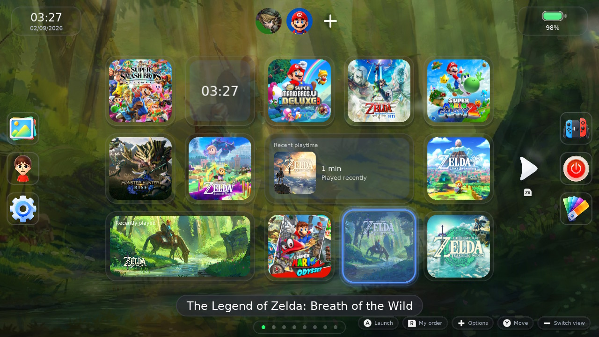
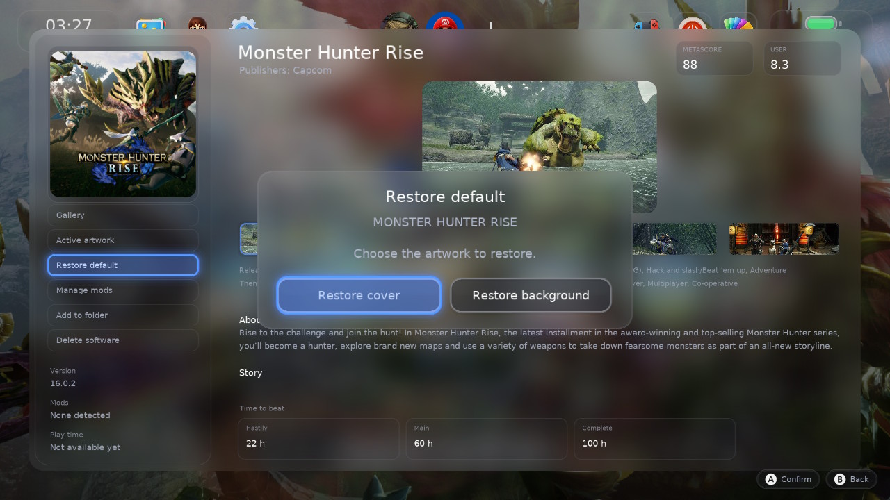
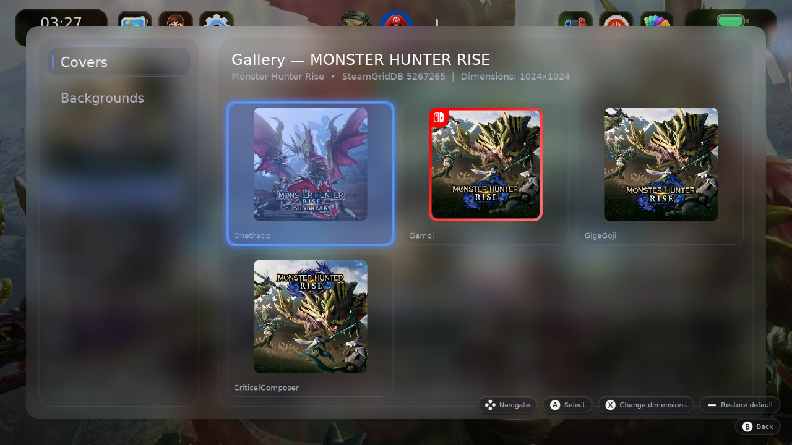
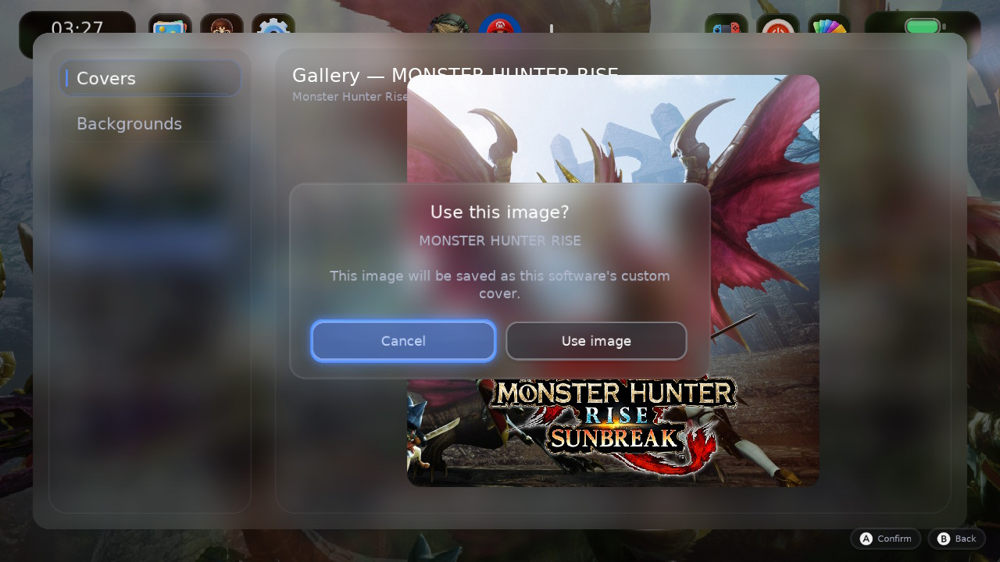

<div align="center">
    <h1>SwitchU</h1>
    <p>A Wii U-style custom home menu replacement for Nintendo Switch</p>
    <p><i>Fork of <a href="https://github.com/PoloNX/SwitchU">PoloNX/SwitchU</a>, whose work this is built on.</i></p>
</div>

<p align="center">
  <a rel="LICENSE" href="https://github.com/ncarvalho99/SwitchU/blob/master/LICENSE">
    
  </a>
  <a rel="VERSION" href="https://github.com/ncarvalho99/SwitchU/releases/latest">
    
  </a>
  <a rel="BUILD" href="https://github.com/ncarvalho99/SwitchU/actions">
      
  </a>
</p>

---

- [Features](#features)
- [Screenshots](#screenshots)
- [Installing](#installing)
- [How to build](#how-to-build)
- [Known issues](#known-issues)
- [Help me](#help-me)
- [Credits](#credits)
- [License](#license)

## Features

### The home menu

- A Wii U-style grid over an animated background, with pages, a configurable
  layout (3–8 columns, 2–5 rows) and drag-to-reorder edit mode.
- Games launch through a daemon that replaces qlaunch, so the menu is a real
  home menu: HOME returns to it, a suspended game resumes, and the console
  sleeps, restarts and shuts down from it.
- Sorting by name, by recently played and by install order. The menu remembers
  the page you were on, per title rather than per page number, so it lands in
  the right place after the grid is rebuilt at a different width.

### Per-game panel

Pressing **+** on a game opens its panel:

- **Details** — a dossier with the description, genre, developer, release date
  and reviews, fetched from a metadata service. Only for native applications;
  homebrew and ports are offered removal instead of an empty dossier.
- **Gallery** — covers and backgrounds from SteamGridDB, picked on the console
  and stored per game, independent of the theme.
- **Mods** — enables, disables and removes LayeredFS content under
  `atmosphere/contents/<titleId>`, one mod at a time rather than treating the
  whole folder as opaque.

### Themes

- Five tabs: **Installed**, **Static Themes**, **Animated Themes**, **Options**
  and **Update**.
- Animated themes are frame sequences compressed as BC1/BC7 and sampled by the
  GPU without unpacking, read a few frames per rendered frame so the menu opens
  immediately and the rest arrives while it is already in your hands.
- The catalogue says what each theme costs to download and what it occupies once
  unpacked, per theme and as a total, and marks the ones already installed.
- L and R turn the page anywhere in the catalogue.

### Updating itself

- The Update tab shows the installed version, what the last check found and what
  changed. The notes for the installed build ship with it, so the tab answers
  before it has spoken to anyone.
- GitHub is checked once a day, and there is a button to check immediately.
- An accepted update is downloaded, checked against the published size and
  inspected path by path; the daemon puts the files in place at the next boot,
  before the menu exists, because a running menu cannot replace the font and
  binaries it is holding open. **That first boot takes about half a minute
  longer.**

### Accessibility and languages

- Voice guidance through eSpeak NG, reading the focused item, its role and its
  position, with a configurable speech rate.
- Eight languages: English, Portuguese, Spanish, French, German, Italian, Dutch
  and Russian.

## Screenshots



<details>
  <summary><b>More screenshots</b></summary>






</details>

## Installing

Download the archive from the [latest release](https://github.com/ncarvalho99/SwitchU/releases/latest)
and copy `atmosphere` and `switch` to the root of the microSD card, replacing
what is there. Restart the console.

Updating from an older build works the same way. Nothing is deleted that the
launcher does not own: your themes, artwork and settings live under
`config/SwitchU` and are left alone.

## How to build

### Requirements

- [devkitPro](https://devkitpro.org/wiki/Getting_Started)
- [Xmake](https://xmake.io/#/)

### Clone

```bash
git clone --recursive https://github.com/ncarvalho99/SwitchU
cd SwitchU
```

### Build (production daemon + external menu mode)

```bash
xmake f -p cross --toolchain=devkita64 --homebrew=n --backend=deko3d
xmake
```

### Build (homebrew .nro mode)

```bash
xmake f -p cross --toolchain=devkita64 --homebrew=y --backend=deko3d
xmake
```

### Clean

```bash
xmake clean
```

Build outputs are generated under `build/cross/aarch64/<mode>/`.

### Local Windows build with Docker

The reproducible local environment is defined in `tools/Dockerfile.build`; it
pins the devkitPro base image used to make SwitchU. After installing Docker
Desktop, create it once and then build the installable sysmodule archive:

```powershell
powershell -NoProfile -ExecutionPolicy Bypass -File .\tools\build-image.ps1 -PullBase
powershell -NoProfile -ExecutionPolicy Bypass -File .\tools\build-local.ps1 -Mode release -Variant sysmodule
```

The resulting archive is `artifacts/SwitchU-sysmodule-release.zip`. When the
Switch microSD card is connected, pass its drive letter with `-ConsoleDrive`
(`E:` by default): a successful sysmodule build copies `atmosphere` and `switch`
to it and verifies the main binaries by SHA-256. Use `-SkipConsoleDeploy` to
keep a build local. Read hardware logs directly with:

```powershell
powershell -NoProfile -ExecutionPolicy Bypass -File .\tools\read-console-logs.ps1
```

## Known issues

- Some settings are still not implemented.
- Memory is tight with many sysmodules running. It has been reduced a good deal,
  but launching a game on a loaded console can still be unstable.
- A theme deleted before v1.1.0+fork.11 left its folder on the card. Those have
  to be removed by hand once; deletions from that version on free the space.

## Help me

If you want to help, open an issue when you find a bug and open a pull request
if you have a fix. Reports that come with the logs from `config/SwitchU` and,
when the console crashed, the files from `atmosphere/fatal_errors` and
`atmosphere/crash_reports`, are the ones that get fixed.

## Credits

- [PoloNX](https://github.com/PoloNX) for SwitchU itself. This fork adds to his
  work and does not replace it.
- Thanks to [Xortroll](https://github.com/Xortroll) for the help and for
  [uLaunch](https://github.com/Xortroll/uLaunch) which inspired this project a lot

## License

This project is licensed under the GNU General Public License v3.0. See the [LICENSE](https://github.com/ncarvalho99/SwitchU/blob/master/LICENSE) file for details.
